# Angular and Node.js App

### Online Food Order

- Front-End: Angular
- Back-End: Node.JS
- Database: MongoDB Atlas

### Features

- Authenticated user login using Json Web Token
- Cart/Basket functionality with Angular partial component and service implementation
- Food search functionality by Angular search partial component, Angular service and back-end Node.JS service (REST API)
  implementation
- Categorized foods by implementation of Angular partial component, Angular service and back-end Node.JS service (REST
  API) implementation
- Food rating
- Page components
- Food delivery time
- Food price calculation at Cart page component
- Search food by food ID, by food name and by food category
- Logout component
- Logged in user storage at temporary memory of browser
- Login page component
- Not found page component
- Input validation component for Login page

### Screenshots

### Login page

### Input validation for email

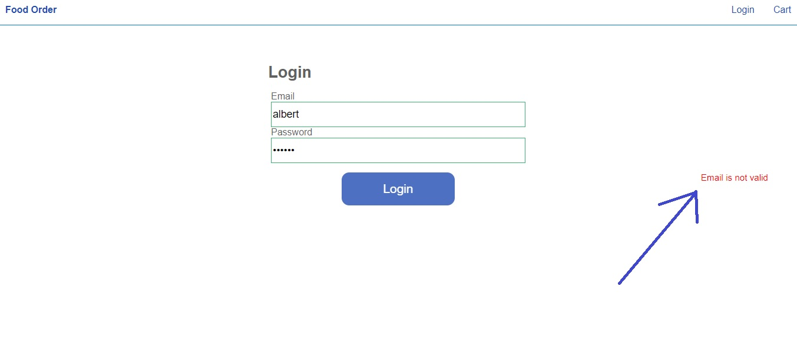

### Login failed animated toast message

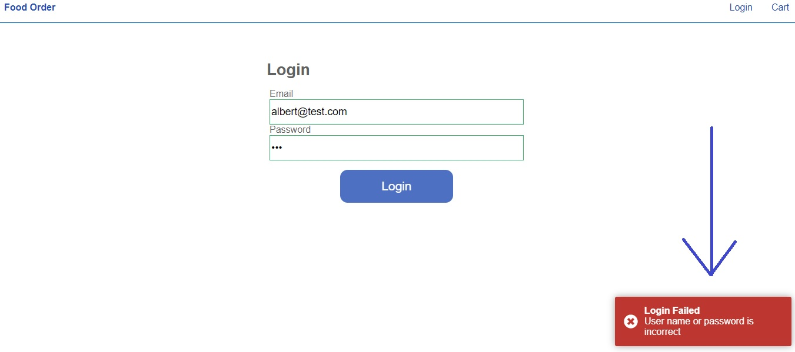

### After successful login

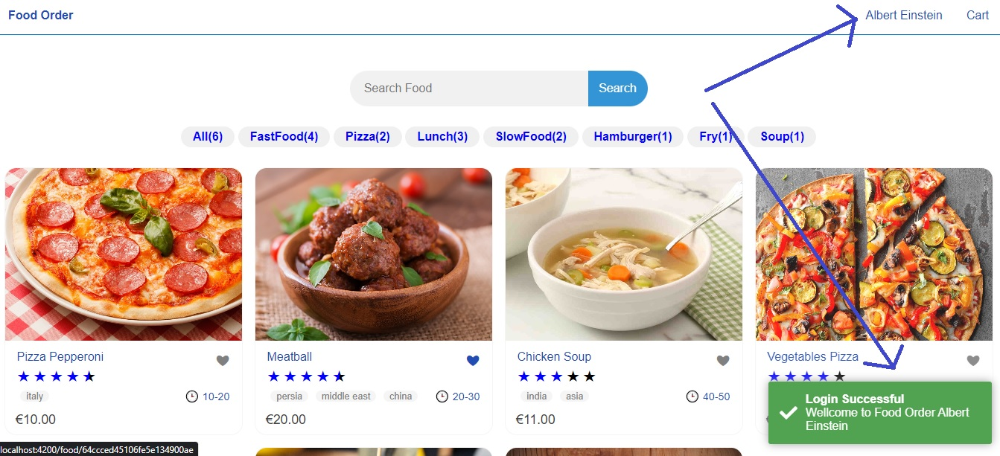

### Filter food by category or Tag

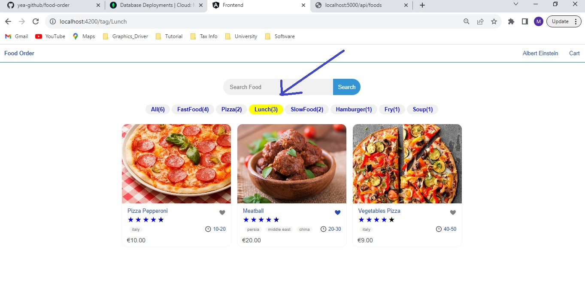

### Food rating, food love option, delivery time or cook time

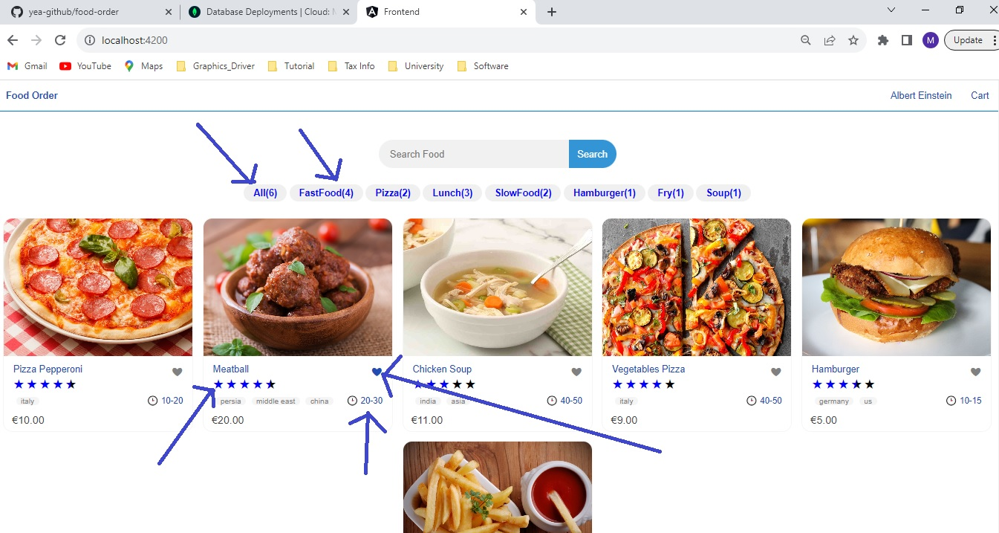

### Food search by food name

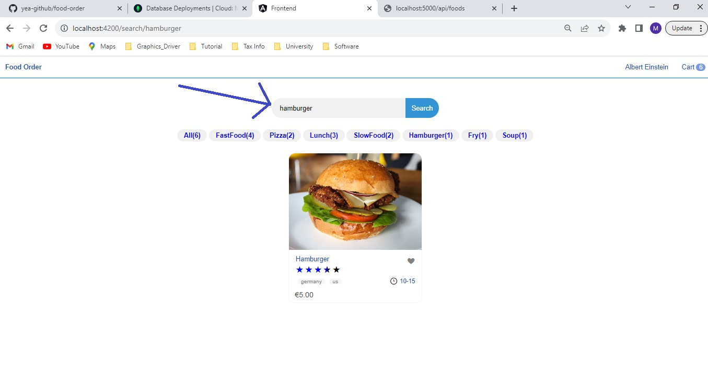

### Food not available component

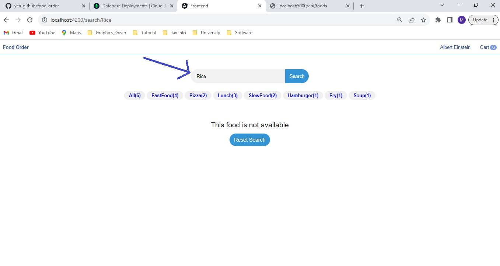

### After food selection, single food page component

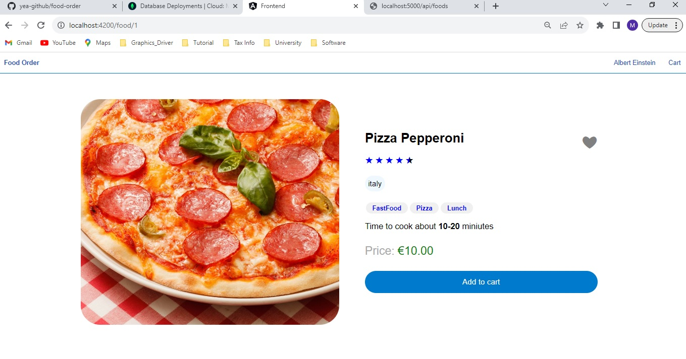

### Cart page component

- Price calculation
- Number of selected food calculation
- Food remove option

### MongoDB Cloud:

- users at MongoDB ATLAS

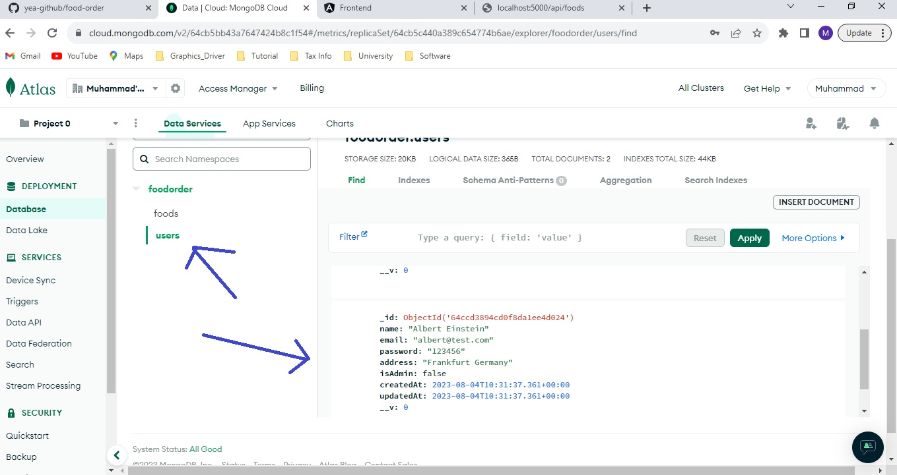

### MongoDB Cloud:

- foods at MongoDB ATLAS

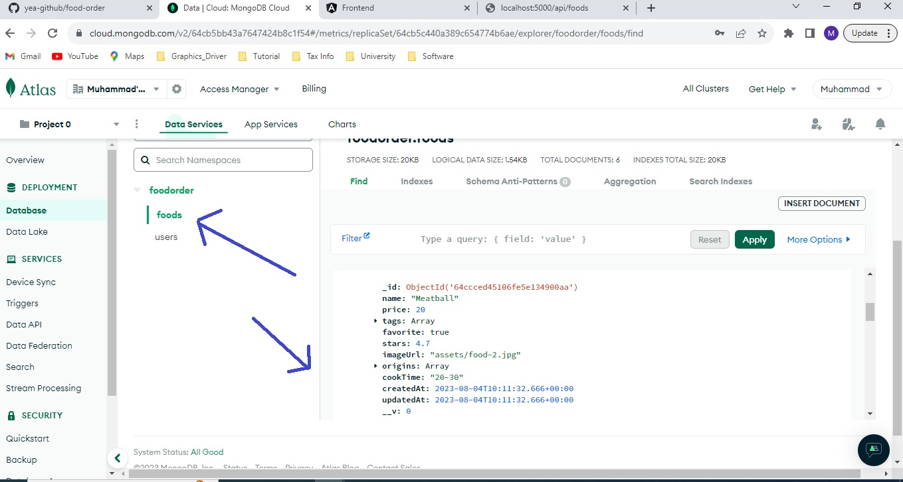

### REST API test in postman

- Login API test

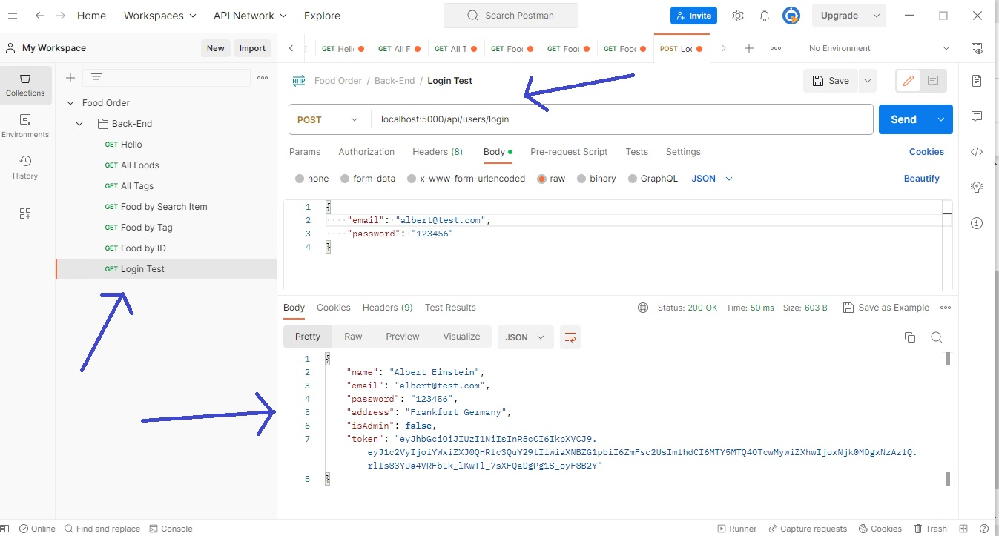

### REST API test in postman

- Food search API test

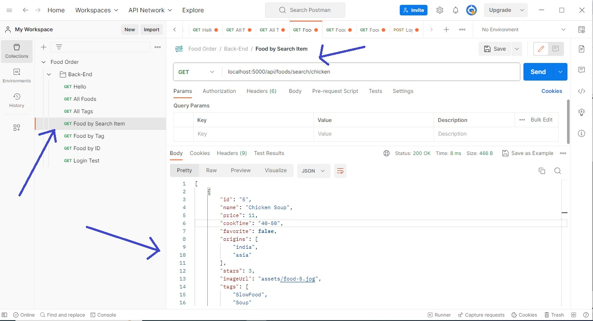

